# 🛡️ CipherVista

<p align="center">
  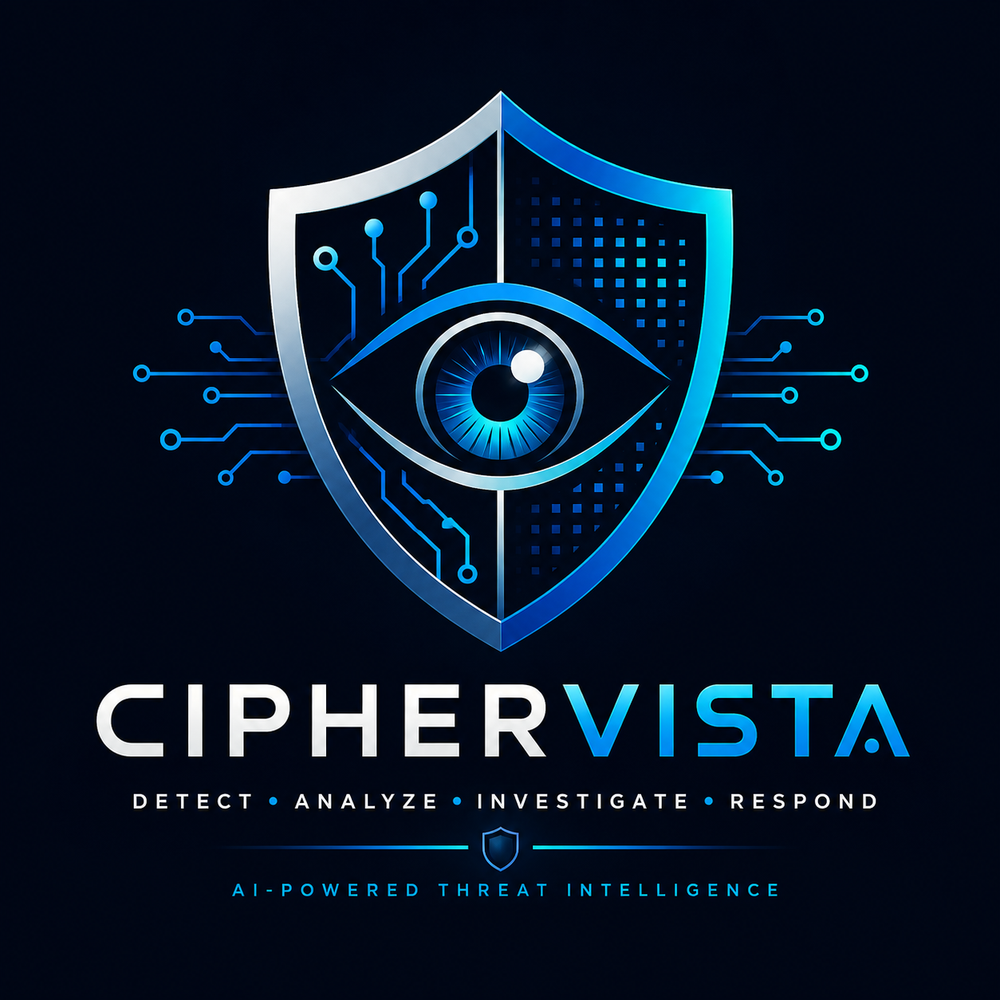
</p>

<h1 align="center">CipherVista</h1>

<p align="center">
  <strong>AI-Powered Real-Time Threat Intelligence & SOC Analyst Platform</strong>
</p>

<p align="center">
  A multi-layer cybersecurity platform combining real-time network monitoring,
  rule-based detection, machine learning, anomaly detection, threat correlation,
  AI-assisted SOC investigation, threat intelligence, authentication and security reporting.
</p>

<p align="center"><strong>Version 3.0</strong></p>

---

## 🔎 Overview

CipherVista is an end-to-end **Security Operations Center (SOC) platform** designed to transform raw network telemetry into actionable security intelligence.

Instead of relying on a single machine-learning model or an LLM, CipherVista combines multiple detection and analysis layers:

```text
Network Traffic
      │
      ▼
┌─────────────────────┐
│   Packet Capture    │
│       Scapy         │
└──────────┬──────────┘
           │
           ▼
┌─────────────────────┐
│    Rule Engine      │
└──────────┬──────────┘
           │
           ├──────────────────┐
           ▼                  ▼
┌─────────────────┐   ┌─────────────────┐
│ Flow Management │   │ ML Detection    │
└────────┬────────┘   └────────┬────────┘
         │                     │
         └──────────┬──────────┘
                    ▼
           ┌───────────────────┐
           │ Threat Correlation│
           └─────────┬─────────┘
                     │
                     ▼
           ┌───────────────────┐
           │ Incident Manager  │
           └─────────┬─────────┘
                     │
                     ▼
           ┌───────────────────┐
           │   AI SOC Analyst  │
           │   Google Gemini   │
           └─────────┬─────────┘
                     │
           ┌─────────┼──────────┐
           ▼         ▼          ▼
      Dashboard  Threat Intel  Reports
```

---

## 🚀 Project Evolution

CipherVista was developed progressively from an AI-assisted threat analysis concept into a complete SOC-style security platform.

### Version 1 — AI Threat Intelligence Assistant

The first version focused on AI-assisted threat analysis:

```text
Threat
  ↓
AI Analysis
  ↓
Security Explanation
  ↓
Recommendations
```

### Version 2 — Multi-Layer Threat Detection

The platform was expanded with network-level detection and machine learning:

```text
Network Traffic
      ↓
Rule-Based Detection
      ↓
Machine Learning
      ↓
Anomaly Detection
      ↓
Threat Analysis
```

This introduced multiple independent detection mechanisms instead of relying entirely on AI.

### Version 3 — CipherVista SOC Platform

The current v3.0 architecture brings the components together into a unified SOC platform.

Major additions include:

- 🔐 Authentication and user management
- ⚡ Real-time packet capture
- 🛡️ Rule-based threat detection
- 🤖 Random Forest classification
- 🔬 Isolation Forest anomaly detection
- 🔗 Threat correlation
- 🚨 Incident management
- 🧠 AI SOC Analyst
- 📦 Batch AI analysis
- 🌐 Threat intelligence
- 📊 Dataset analysis
- 📋 Security reporting
- 🎨 SOC-style interface

---

## ✨ Core Capabilities

### 🔐 Authentication & Access Control

CipherVista includes a dedicated authentication system instead of exposing the SOC dashboard directly.

```text
User
 ↓
Registration / Login
 ↓
FastAPI Authentication API
 ↓
Password Verification
 ↓
JWT Access Token
 ↓
Protected Streamlit Application
```

Features:

- User registration
- Secure login
- Password hashing
- JWT-based authentication
- Protected application access
- Token-based session handling
- User-specific report storage

---

### 📊 SOC Command Center

The SOC Command Center acts as the central workspace for security analysts.

It provides visibility into:

- Threat detections
- Network anomalies
- Security events
- ML detection activity
- AI analysis
- System status
- Security posture
- Analyst activity

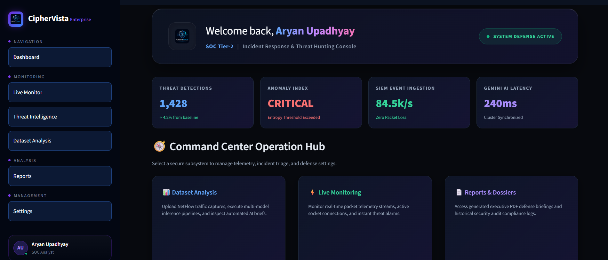

---

### ⚡ Real-Time Network Monitoring

CipherVista can capture and process live network packets using **Scapy**.

The monitoring engine tracks:

- TCP packets
- UDP packets
- ICMP packets
- Source IP
- Destination IP
- Source and destination ports
- Packet counts
- Packets per second
- Recent network traffic
- Detection alerts
- ML predictions

#### Live Monitoring

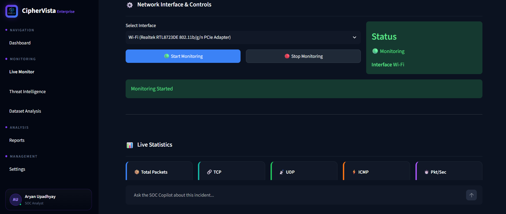

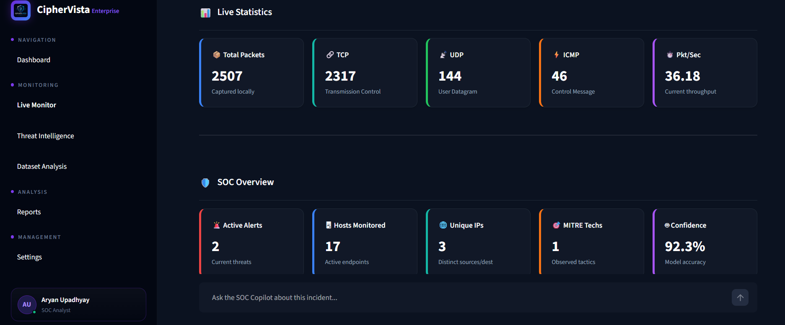

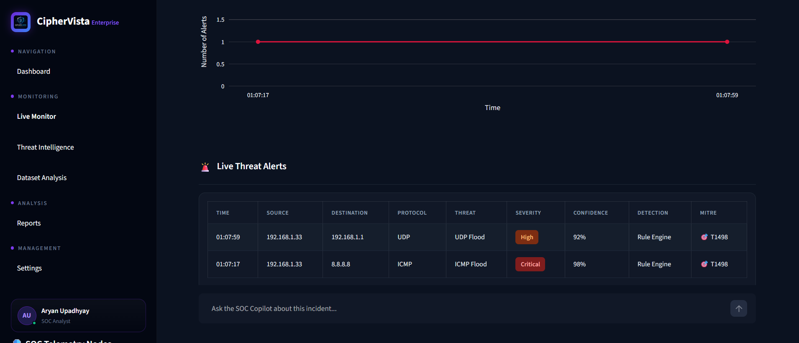

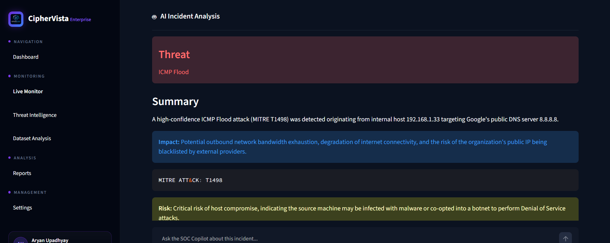

---

## 🛡️ Multi-Layer Threat Detection

CipherVista uses multiple detection layers to improve security visibility.

### 1. Rule-Based Detection

The Rule Engine identifies known network attack patterns.

Current rule-based detections include:

| Threat | Detection |
|---|---|
| ICMP Flood | Rule Engine |
| UDP Flood | Rule Engine |
| SYN Flood | Rule Engine |
| Port Scan | Rule Engine |

The engine maintains packet-level state and evaluates traffic against configurable detection thresholds.

### 2. Machine Learning Detection

CipherVista uses a **Random Forest** model for supervised network attack classification.

```text
Network Flow
     ↓
Feature Generation
     ↓
Feature Processing
     ↓
Random Forest
     ↓
Attack Classification
     ↓
Confidence Score
```

### 3. Anomaly Detection

An **Isolation Forest** model provides an additional unsupervised detection layer.

The system generates:

- Anomaly status
- Anomaly score
- Prediction confidence
- Attack classification

This allows CipherVista to identify suspicious behavior that may not necessarily match a fixed rule.

---

## 🔗 Threat Correlation

CipherVista does not treat every detection independently.

Rule-based detections and ML predictions can be correlated with network flow information:

```text
Rule Detection
      +
ML Prediction
      +
Network Flow
      ↓
Threat Correlation
      ↓
Incident
```

This creates a more complete representation of a security event before it reaches the AI analysis layer.

---

## 🚨 Incident Management

Detected threats are passed through an incident management layer.

The system can maintain:

- Threat information
- Severity
- Risk score
- Confidence
- Source and destination
- Detection method
- MITRE ATT&CK mapping
- Evidence

This provides a structured representation of security incidents throughout the pipeline.

---

## 🧠 AI SOC Analyst

One of CipherVista's primary features is its AI-assisted SOC investigation system.

Detected threats can be analyzed using **Google Gemini**.

```text
Threat
  ↓
Prompt Builder
  ↓
Gemini
  ↓
Response Parser
  ↓
Structured Security Analysis
  ↓
Incident / Report
```

The AI analysis can provide:

- Threat summary
- Potential impact
- Recommended actions
- Risk interpretation
- MITRE ATT&CK context
- Investigation insights

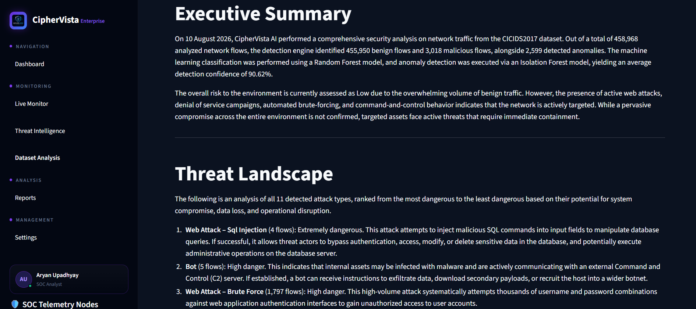

---

## 📦 Batch AI Analysis

CipherVista includes an analysis queue to avoid sending every individual event directly to the AI model.

```text
Detected Threats
      ↓
Analysis Queue
      ↓
Batch Processing
      ↓
Gemini SOC Analyst
      ↓
Structured Results
```

This architecture allows multiple incidents to be processed together while reducing unnecessary AI requests.

---

## 🌐 Threat Intelligence

The Threat Intelligence module provides a dedicated workspace for investigating security events and threat information.

It connects the detection pipeline with analyst-oriented investigation workflows.

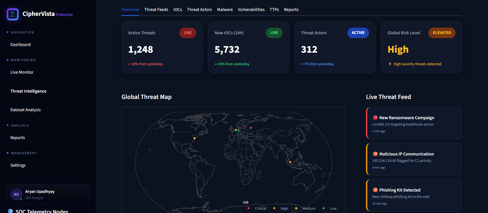

---

## 📁 Dataset Analysis

CipherVista also supports offline network dataset analysis.

The dataset pipeline combines machine learning, anomaly detection and AI investigation.

```text
CSV Dataset
     ↓
Feature Processing
     ↓
Random Forest Classification
     ↓
Isolation Forest Detection
     ↓
Gemini AI Investigation
     ↓
Security Analysis
     ↓
Report
```

### Dataset Analysis Interface

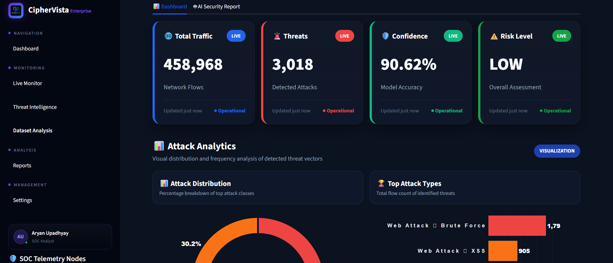

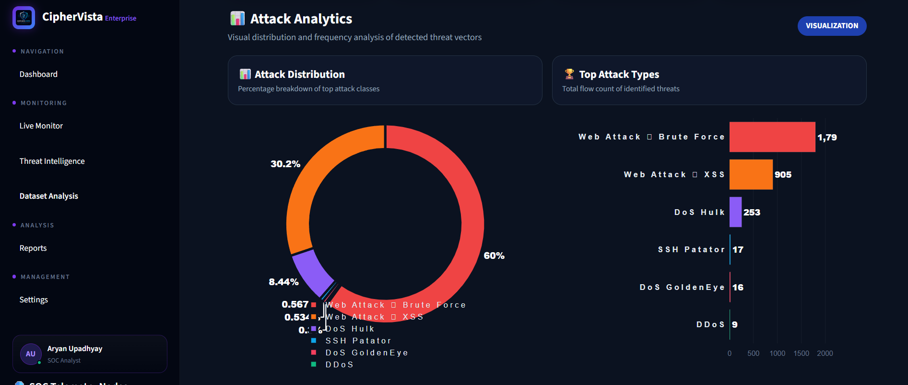

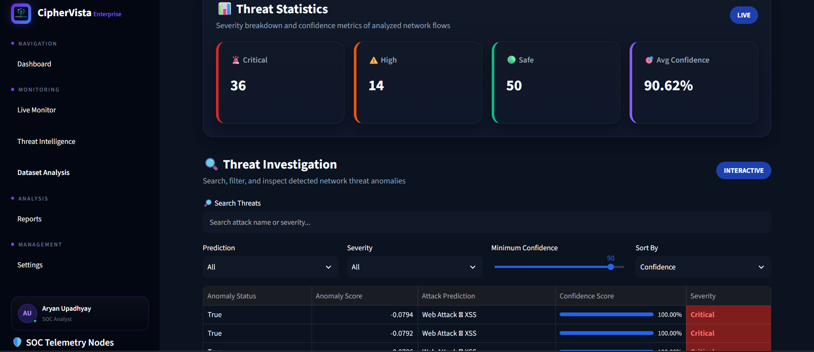

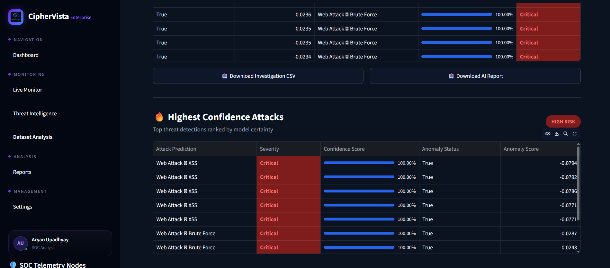

---

## 📋 Security Reporting

CipherVista provides a reporting layer for security investigations.

Reports can contain:

- Detected threats
- Severity
- Risk
- ML predictions
- Confidence
- Anomaly information
- AI-generated analysis
- Investigation results

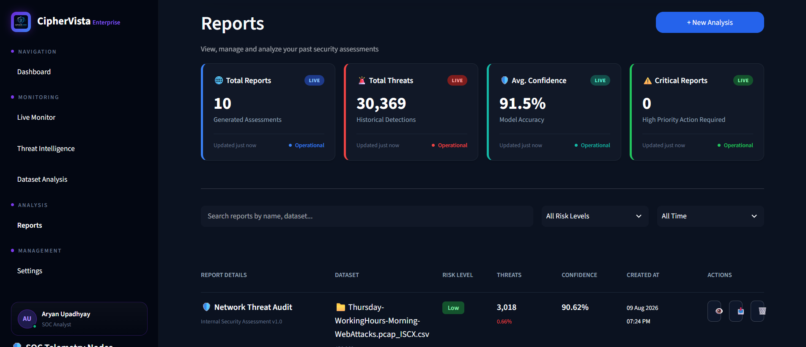

---

## ⚙️ Settings

CipherVista includes a dedicated settings interface for platform configuration and user management.

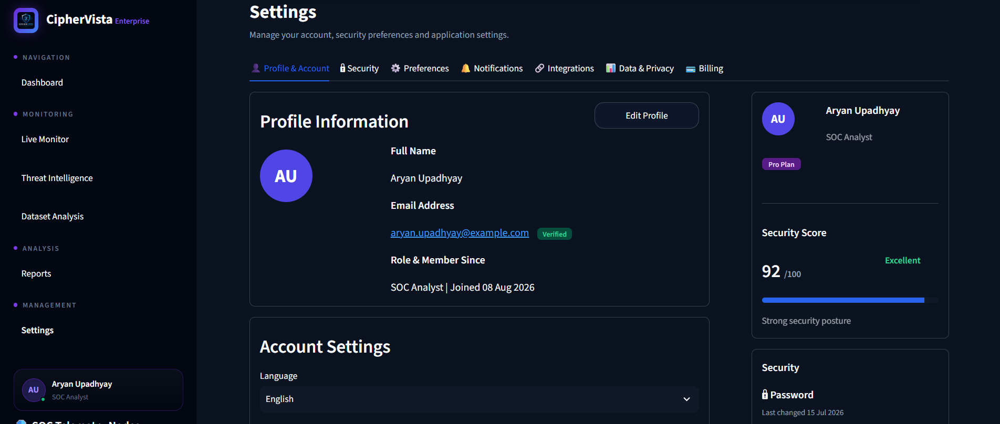

---

## 🤖 Machine Learning Architecture

The ML subsystem contains multiple components.

### Random Forest

Supervised network attack classification.

### Isolation Forest

Unsupervised anomaly detection.

### Feature Engineering

Transforms network traffic and flow information into model-compatible features.

### Model Manager

Centralizes model loading and prediction operations.

### Preprocessing

The trained models use the corresponding preprocessing artifacts stored in the project.

```text
models/
├── random_forest.pkl
├── isolation_forest.pkl
├── scaler.pkl
└── label_encoder.pkl
```

The large Random Forest model is tracked using **Git LFS**.

---

## 🧪 Detection Coverage

| Capability | Technology |
|---|---|
| ICMP Flood Detection | Rule Engine |
| UDP Flood Detection | Rule Engine |
| SYN Flood Detection | Rule Engine |
| Port Scan Detection | Rule Engine |
| Network Attack Classification | Random Forest |
| Network Anomaly Detection | Isolation Forest |
| Threat Correlation | Detection Correlator |
| Incident Management | Incident Manager |
| AI Investigation | Google Gemini |
| Real-Time Packet Capture | Scapy |
| Dataset Analysis | ML + AI |
| Security Reports | Reporting Engine |

---

## 🧰 Technology Stack

### Programming

- Python

### Frontend

- Streamlit
- HTML
- CSS
- Plotly

### Backend

- FastAPI
- Uvicorn
- SQLAlchemy
- PostgreSQL
- Pydantic

### Authentication

- JWT
- Passlib / bcrypt
- Python-Jose

### Machine Learning

- Scikit-learn
- Random Forest
- Isolation Forest
- Pandas
- NumPy
- Joblib

### Artificial Intelligence

- Google Gemini API
- Prompt engineering
- Structured response parsing
- Batch AI analysis

### Network Security

- Scapy
- Packet capture
- Network flow analysis
- Rule-based detection
- Threat correlation

### Reporting

- ReportLab
- CSV processing

---

## 🏗️ Project Structure

```text
CipherVista/
│
├── assets/
│   ├── favicon.ico
│   ├── logo.png
│   └── screenshots/
│       ├── ai_summary.png
│       ├── dashboard.png
│       ├── dataset_analysis1.png
│       ├── dataset_analysis2.png
│       ├── dataset_analysis3.png
│       ├── dataset_analysis4.png
│       ├── live_monitoring1.png
│       ├── live_monitoring2.png
│       ├── live_monitoring3.png
│       ├── live_monitoring4.png
│       ├── login.png
│       ├── reports.png
│       ├── settings.png
│       └── threat_intelligence.png
│
├── dashboard/
│   ├── app.py
│   ├── styles.py
│   ├── components/
│   └── pages/
│       ├── Dashboard.py
│       ├── live_monitoring.py
│       ├── threat_intelligence.py
│       ├── dataset_analysis.py
│       ├── reports.py
│       └── settings.py
│
├── models/
│   ├── random_forest.pkl
│   ├── isolation_forest.pkl
│   ├── scaler.pkl
│   └── label_encoder.pkl
│
├── src/
│   ├── ai/
│   ├── api/
│   ├── capture/
│   ├── core/
│   ├── database/
│   ├── detection/
│   ├── ml/
│   ├── realtime/
│   ├── reports/
│   ├── schemas/
│   └── threat_intelligence/
│
├── data/
├── reports/
├── .env.example
├── .gitignore
├── .gitattributes
├── requirements.txt
└── README.md
```

---

## 🔑 Environment Configuration

CipherVista uses environment variables for sensitive configuration.

Create a `.env` file based on `.env.example`:

```env
GEMINI_API_KEY1=
GEMINI_API_KEY2=
GEMINI_API_KEY3=

DATABASE_URL=

SECRET_KEY=
ALGORITHM=
ACCESS_TOKEN_EXPIRE_MINUTES=
```

### Security

Sensitive credentials must never be committed to the repository.

- `.env` is excluded through `.gitignore`
- `.env.example` contains only placeholders
- Database credentials are loaded from environment configuration
- API keys are not stored in source control

---

## ⚙️ Installation

### 1. Clone the repository

```bash
git clone YOUR_REPOSITORY_URL
cd CipherVista
```

### 2. Create a virtual environment

#### Windows

```bash
python -m venv .venv
.venv\Scripts\activate
```

#### Linux / macOS

```bash
python -m venv .venv
source .venv/bin/activate
```

### 3. Install dependencies

```bash
pip install -r requirements.txt
```

### 4. Configure environment variables

Create:

```text
.env
```

and add the required Gemini, PostgreSQL and JWT configuration.

---

## ▶️ Running the Platform

CipherVista consists of a **FastAPI backend** and a **Streamlit dashboard**.

### Start the FastAPI backend

```bash
uvicorn src.api.app:app --reload
```

### Start the Streamlit dashboard

```bash
streamlit run dashboard/app.py
```

Open the Streamlit URL displayed in the terminal.

> **Note:** Real-time packet capture requires appropriate network-interface access and a suitable environment for Scapy. The full live-monitoring functionality is therefore primarily intended for a local or appropriately configured server environment.

---

## 🔐 Security Practices

CipherVista implements several security-oriented practices:

- Environment-based secret management
- `.env` excluded from version control
- JWT authentication
- Password hashing
- Protected application routes
- API-based backend architecture
- User-specific report storage
- Git LFS for large ML model artifacts
- Runtime/generated data excluded from source control

---

# 📸 Complete Platform Gallery

## 🔐 Authentication

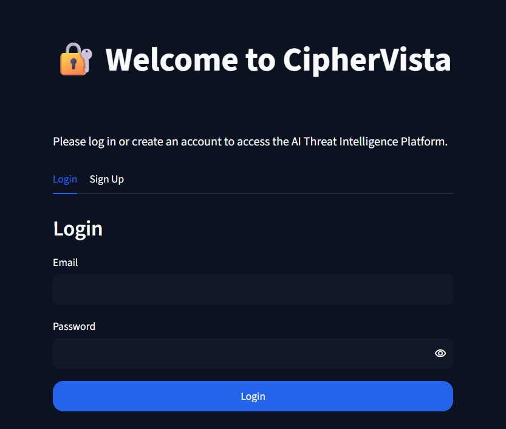

## 📊 SOC Command Center


## ⚡ Live Network Monitoring


## 🌐 Threat Intelligence


## 📁 Dataset Analysis


## 🧠 AI Security Analysis


## 📋 Reports


## ⚙️ Settings


---

## 🎯 What Makes CipherVista Different?

A typical academic cybersecurity ML project may look like:

```text
Dataset
   ↓
ML Model
   ↓
Prediction
```

CipherVista expands this into a complete security workflow:

```text
                    REAL NETWORK TRAFFIC
                            │
                            ▼
                     PACKET CAPTURE
                            │
                            ▼
                       RULE ENGINE
                            │
                  ┌─────────┴─────────┐
                  ▼                   ▼
           FLOW ANALYSIS       ML DETECTION
                  │                   │
                  └─────────┬─────────┘
                            ▼
                    THREAT CORRELATION
                            │
                            ▼
                    INCIDENT MANAGEMENT
                            │
                            ▼
                       AI SOC ANALYST
                            │
                  ┌─────────┼─────────┐
                  ▼         ▼         ▼
            THREAT INTEL DASHBOARD  REPORTS
```

The project therefore combines:

**Cybersecurity + Machine Learning + Artificial Intelligence + Network Programming + Backend Development + Real-Time Systems + Data Processing + Security Analytics**

---

## 🔮 Future Improvements

Potential future enhancements include:

- SIEM integrations
- MITRE ATT&CK enrichment
- External threat intelligence feeds
- IOC reputation services
- Automated response actions
- Email / Slack security alerts
- Role-based access control
- Advanced incident timelines
- Distributed packet monitoring
- Containerized deployment
- Cloud deployment
- Additional ML attack classes
- Persistent event streaming

---

## 👨‍💻 Developer

<p align="center">
  <strong>Aryan Upadhyay</strong>
</p>

<p align="center">
  Computer Science & Engineering (Artificial Intelligence)
</p>

<p align="center">
  Cybersecurity • Machine Learning • Artificial Intelligence • Backend Development
</p>

---

## 📌 Project Status

### CipherVista v3.0

Current platform includes:

- ✓ Authentication
- ✓ JWT Security
- ✓ Real-Time Packet Capture
- ✓ Rule-Based Detection
- ✓ Random Forest Classification
- ✓ Isolation Forest Anomaly Detection
- ✓ Flow Management
- ✓ Threat Correlation
- ✓ Incident Management
- ✓ AI SOC Analyst
- ✓ Batch AI Analysis
- ✓ Threat Intelligence
- ✓ Dataset Analysis
- ✓ Security Reporting
- ✓ SOC Command Center
- ✓ Premium SOC UI

---

<p align="center">
  <strong>🛡️ CipherVista</strong>
</p>

<p align="center">
  Turning Network Telemetry into Actionable Security Intelligence.
</p>

<p align="center">
  Built with Python • FastAPI • Streamlit • Scikit-learn • Scapy • Google Gemini
</p>
